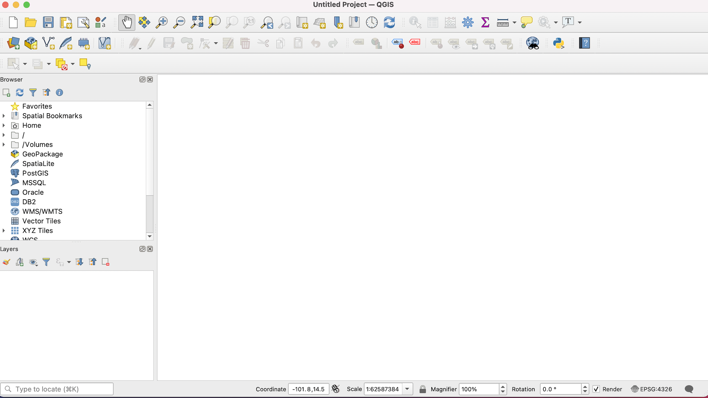
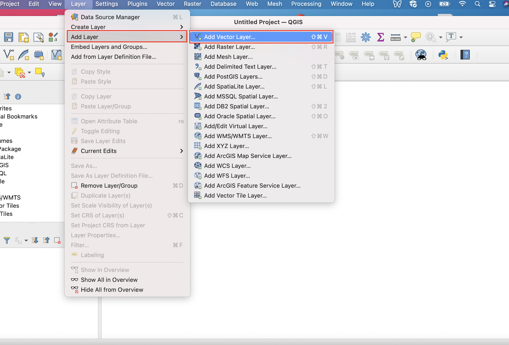

# (PART) Maps in QGIS {-}

# Building Maps in Quantum Geographic Information Systems (QGIS)

```{r, echo=F, fig.cap="The main QGIS window"}

```

```{r, echo=F, fig.cap="Navigating to the 'Add Vector Layer' Menu"}

```

```{r, echo=F, fig.cap="Click the 'Browse' button to navigate to your shapefile"}
knitr::include_graphics("screenshots/browse.png")
```

