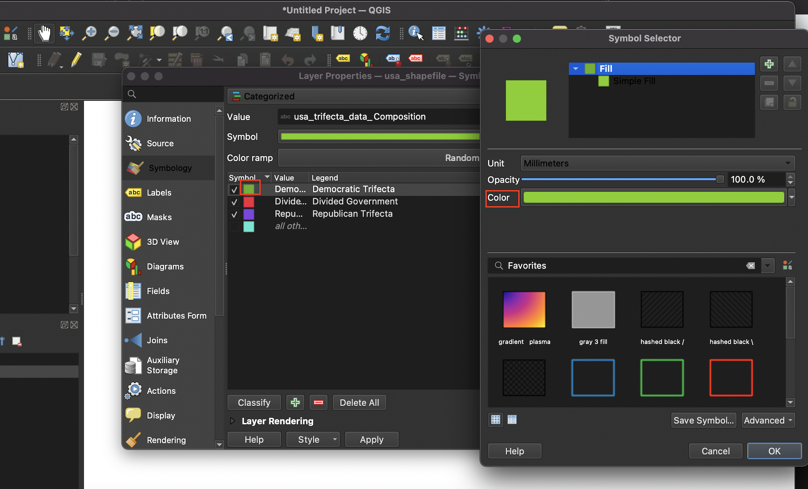
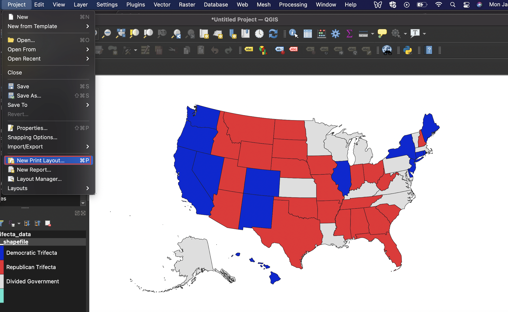
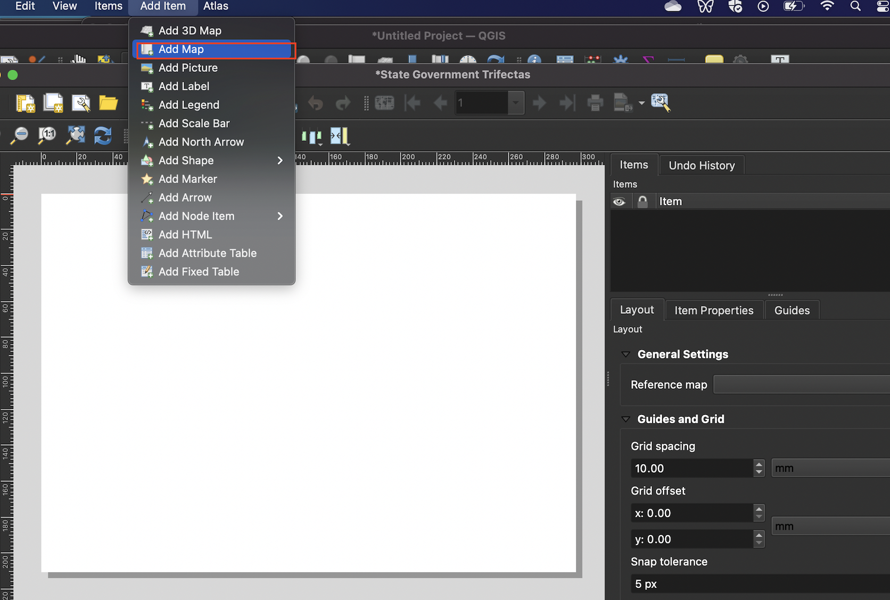
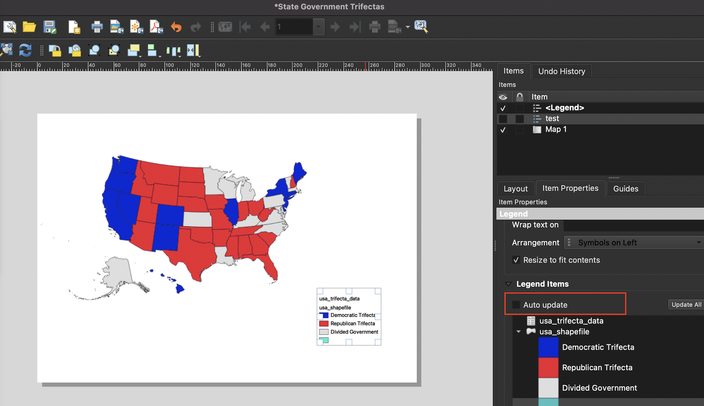

# (PART) Maps in QGIS {-}

# Building Maps in Quantum Geographic Information Systems (QGIS)

When you open up a new QGIS project, the interface will look something like this:

```{r, echo=F, fig.cap="The main QGIS window"}
knitr::include_graphics("screenshots/qgis_window.png")
```

## Adding a spatial dataset to QGIS 

To add a spatial dataset (and in particular, a shapefile) to QGIS, first select ```Layer``` from the top menu, scroll down to ```Add Layer``` and then select ```Add Vector Layer```:

```{r, echo=F, fig.cap="Navigating to the 'Add Vector Layer' Menu"}
knitr::include_graphics("screenshots/add_vector_layer.png")
```

This will open up the ```Data Source Manager|Vector``` dialog box. Under the ```Source``` tab, click on the ellipsis that is to the right of the box next to the ```Vector Dataset(s)``` label. This ```Browse``` button will open up another dialog box, from which you can navigate to the directory containing your shapefile. 

```{r, echo=F, fig.cap="Click the 'Browse' button to navigate to your shapefile"}
knitr::include_graphics("screenshots/browse.png")
```

Once you are in the directory containing the shapefile you want to import, select the file with the ```.shp``` extension, and click ```Open```.
```{r, echo=F, fig.cap="Select shapefile from directory"}
knitr::include_graphics("screenshots/select_shapefile.png")
```

At this point, you will see the file path to the shapefile under the ```Source``` tab. Once you see this path, go ahead and click the ```Add``` button:

```{r, echo=F, fig.cap="Confirm the shapefile's path and click 'Add'"}
knitr::include_graphics("screenshots/add_shapefile.png")
```

Once the shapefile has been added, it will appear in the QGIS project window. Note that the color of the shapefile when it is first imported is arbitrarily set by QGIS, but this initial color can always be changed. 

```{r, echo=F, fig.cap="The rendered shapefile/spatial dataset rendered in the QGIS project window" }
knitr::include_graphics("screenshots/rendered_shapefile.png")
```

## Inspect the shapefile's attribute table

To inspect the attribute table that is associated with the shapefile, right-click on the shapefile in the ```Layers``` window, and select ```Open Attribute Table```.

```{r, echo=F, fig.cap="Open the the shapefile's attribute table" }
knitr::include_graphics("screenshots/open_attribute_table.png")
```

When the attribute table is open, it will look something like this. When you select a record in the attribute table (by clicking on it), the corresponding geographic attribute will automatically be selected on the map (and vice versa). Here, we clicked on the ```Colorado``` record within the attribute table, which simultaneously highlighted Colorado on the shapefile's geographic representation in the project window: 

```{r, echo=F, fig.cap="Select a record within the opened attribute table" }
knitr::include_graphics("screenshots/attribute_table_selection.png")
```

If you want to deselect a selected record, click the ```Deselect all features from the layer``` button in the menu bar on top of the attribute table: 

```{r, echo=F, fig.cap="Deselect a selected record"}
knitr::include_graphics("screenshots/deselect_layer.png")
```

## Add tabular CSV data to QGIS

Having adding the shapefile to QGIS, let's import the tabular dataset (stored as a CSV file) that contains information on partisan control over state governments, which is the data that we want to ultimately visualize on a map. 

To add the CSV file, click the ```Layer``` menu from the QGIS menu bar, and then select ```Add Layer``` followed by ```Add Delimited Text Layer```: 

```{r, echo=F, fig.cap="Navigate to menu that facilitates the importing of tabular data" }
knitr::include_graphics("screenshots/delimited_text.png")
```

Click on the ellipsis next to the ```File name``` bar, and then navigate to the CSV file on your computer and add it; at this point, the file path to the CSV will appear next to the ```File name``` bar. Under the ```File Format``` section, make sure that the ```CSV (comma separated values)``` button is selected. Finally, under the ```Geometry Definition``` section, select the ```No geometry (attribute table only)``` button. Once these selections are made, go ahead and click the ```Add``` button on the bottom of the dialog box. 

```{r, echo=F, fig.cap="Set paremeters before adding the CSV file" }
knitr::include_graphics("screenshots/delimited_text_import.png")
```

At this point, you'll notice the CSV file (named ```usa_trifecta_data```) added to the ```Layers``` section on the bottom-left of the QGIS interface (right above the shapefile). To inspect the CSV file, right-click on the file in the ```Layers``` menu, and select ```Open Attribute Table```,  

```{r, echo=F, fig.cap="Open the CSV file within QGIS" }

```

The tabular dataset/CSV file, when opened up in QGIS, will look something like this:

```{r, echo=F, fig.cap="The tabular dataset open within QGIS" }
knitr::include_graphics("screenshots/inspect_table.png")
```

## Join the tabular data (```usa_trifecta_data```) to the shapefile (```usa_shapefile```)


```{r, echo=F, fig.cap="Open the 'properties' dialog box" }
knitr::include_graphics("screenshots/25.png")
```

```{r, echo=F, fig.cap="Initiating a join" }
knitr::include_graphics("screenshots/26.png")
```

```{r, echo=F, fig.cap="The 'Add vector join' dialog box" }
knitr::include_graphics("screenshots/30.png")
```

```{r, echo=F, fig.cap="Finalize join" }
knitr::include_graphics("screenshots/31.png")
```

```{r, echo=F, fig.cap="Shapefile's attribute table after join" }
knitr::include_graphics("screenshots/35.png")
```

## Display the state government categorical data on the shapefile 

```{r, echo=F, fig.cap="Opening the `Symbology` tab from the `Properties` dialog box" }
knitr::include_graphics("screenshots/symbology1.png")
```

```{r, echo=F, fig.cap="Select classification scheme from menu bar; here, 'Categorized'" }

```


```{r, echo=F, fig.cap="Select column containing categories to be mapped from the 'value' drop-down menu" }
knitr::include_graphics("screenshots/symbology3.png")
```


```{r, echo=F, fig.cap="Select categories to be displayed" }
knitr::include_graphics("screenshots/selecting_categories.png")
```

```{r, echo=F, fig.cap="Select colors for each category" }

```

```{r, echo=F, fig.cap="Apply color changes" }
knitr::include_graphics("screenshots/colors2.png")
```

```{r, echo=F, fig.cap="Map with changes applied" }
knitr::include_graphics("screenshots/modified_map.png")
```

## Make a print map using the ```Print Layout``` interface

```{r, echo=F, fig.cap="Open Print Layout" }

```

```{r, echo=F, fig.cap="Give Print Layout a title" }
knitr::include_graphics("screenshots/print_layout_title.png")
```


```{r, echo=F, fig.cap="Click 'Add Map' from the 'Add Item' menu bar" }

```


```{r, echo=F, fig.cap="Click and drag across the map canvas" }
knitr::include_graphics("screenshots/clickdrag.png")
```


```{r, echo=F, fig.cap="Shapefile imported into QGIS print layout as a map" }

```

```{r, echo=F, fig.cap="Add a legend from the 'Add Item' menu" }
knitr::include_graphics("screenshots/addlegend.png")
```


```{r, echo=F, fig.cap="Legend's initial appearance" }
knitr::include_graphics("screenshots/legendimported.png")
```


```{r, echo=F, fig.cap="Uncheck the auto update button" }

```


```{r, echo=F, fig.cap="Remove superfluous legend category" }
knitr::include_graphics("screenshots/remove_legend_item.png")
```


```{r, echo=F, fig.cap="Remove superfluous legend label" }
knitr::include_graphics("screenshots/delete_legend_items.png")
```


```{r, echo=F, fig.cap="Scroll to legend dialog box's 'Font' section" }

```

```{r, echo=F, fig.cap="Click on the 'Font' button under the 'Item Labels' heading" }
knitr::include_graphics("screenshots/editfont.png")
```


```{r, echo=F, fig.cap="Set legend font preferences" }
knitr::include_graphics("screenshots/fontdialogbox.png")
```


```{r, echo=F, fig.cap="Click 'Add Label' from the 'Add Item' menu" }

```


```{r, echo=F, fig.cap="Print the text for the title in the 'Main Properties' dialog box associated with the label" }
knitr::include_graphics("screenshots/addtitle.png")
```

```{r, echo=F, fig.cap="Customize the title's font and size" }
knitr::include_graphics("screenshots/titlefontsize.png")
```

```{r, echo=F, fig.cap="Add map credits" }

```

## Export the completed map from QGIS 

```{r, echo=F, fig.cap="Exporting a completed map from QGIS" }

```

```{r, echo=F, fig.cap="The map exported from QGIS as a png file" }

```


