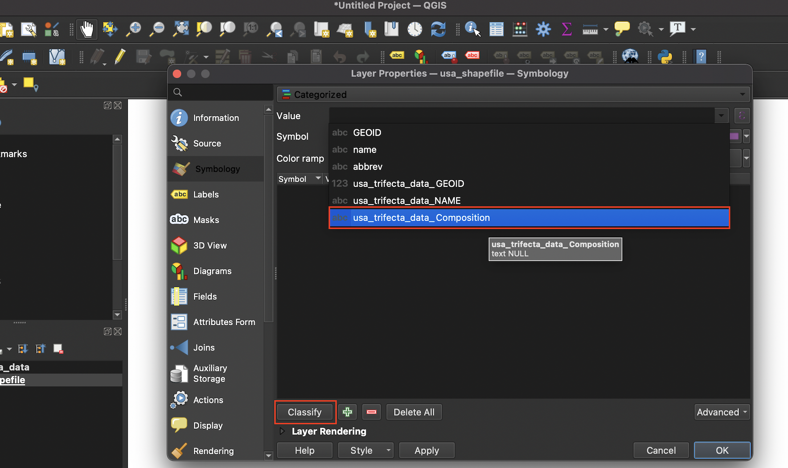

# (PART) Maps in QGIS {-}

# Building Maps in Quantum Geographic Information Systems (QGIS)

When you open up a new QGIS project, the interface will look something like this:

```{r, echo=F, fig.cap="The main QGIS window"}
knitr::include_graphics("screenshots/qgis_window.png")
```

## Adding a spatial dataset to QGIS 

To add a spatial dataset (and in particular, a shapefile) to QGIS, first select ```Layer``` from the top menu, scroll down to ```Add Layer``` and then select ```Add Vector Layer```:

```{r, echo=F, fig.cap="Navigating to the 'Add Vector Layer' Menu"}
knitr::include_graphics("screenshots/add_vector_layer.png")
```

This will open up the ```Data Source Manager|Vector``` dialog box. Under the ```Source``` tab, click on the ellipsis that is to the right of the box next to the ```Vector Dataset(s)``` label. This ```Browse``` button will open up another dialog box, from which you can navigate to the directory containing your shapefile. 

```{r, echo=F, fig.cap="Click the 'Browse' button to navigate to your shapefile"}
knitr::include_graphics("screenshots/browse.png")
```

Once you are in the directory containing the shapefile you want to import, select the file with the ```.shp``` extension, and click ```Open```.
```{r, echo=F, fig.cap="Select shapefile from directory"}
knitr::include_graphics("screenshots/select_shapefile.png")
```

At this point, you will see the file path to the shapefile under the ```Source``` tab. Once you see this path, go ahead and click the ```Add``` button:

```{r, echo=F, fig.cap="Confirm the shapefile's path and click 'Add'"}
knitr::include_graphics("screenshots/add_shapefile.png")
```

Once the shapefile has been added, it will appear in the QGIS project window. Note that the color of the shapefile when it is first imported is arbitrarily set by QGIS, but this initial color can always be changed. 

```{r, echo=F, fig.cap="The rendered shapefile/spatial dataset rendered in the QGIS project window" }
knitr::include_graphics("screenshots/rendered_shapefile.png")
```

## Inspect the shapefile's attribute table

To inspect the attribute table that is associated with the shapefile, right-click on the shapefile in the ```Layers``` window, and select ```Open Attribute Table```.

```{r, echo=F, fig.cap="Open the the shapefile's attribute table" }
knitr::include_graphics("screenshots/open_attribute_table.png")
```

When the attribute table is open, it will look something like this. When you select a record in the attribute table (by clicking on it), the corresponding geographic attribute will automatically be selected on the map (and vice versa). Here, we clicked on the ```Colorado``` record within the attribute table, which simultaneously highlighted Colorado on the shapefile's geographic representation in the project window: 

```{r, echo=F, fig.cap="Select a record within the opened attribute table" }
knitr::include_graphics("screenshots/attribute_table_selection.png")
```

If you want to deselect a selected record, click the ```Deselect all features from the layer``` button in the menu bar on top of the attribute table: 

```{r, echo=F, fig.cap="Deselect a selected record"}
knitr::include_graphics("screenshots/deselect_layer.png")
```

## Add tabular CSV data to QGIS

Having adding the shapefile to QGIS, let's import the tabular dataset (stored as a CSV file) that contains information on partisan control over state governments, which is the data that we want to ultimately visualize on a map. 

To add the CSV file, click the ```Layer``` menu from the QGIS menu bar, and then select ```Add Layer``` followed by ```Add Delimited Text Layer```: 

```{r, echo=F, fig.cap="Navigate to menu that facilitates the importing of tabular data" }
knitr::include_graphics("screenshots/delimited_text.png")
```

Click on the ellipsis next to the ```File name``` bar, and then navigate to the CSV file on your computer and add it; at this point, the file path to the CSV will appear next to the ```File name``` bar. Under the ```File Format``` section, make sure that the ```CSV (comma separated values)``` button is selected. Finally, under the ```Geometry Definition``` section, select the ```No geometry (attribute table only)``` button. Once these selections are made, go ahead and click the ```Add``` button on the bottom of the dialog box. 

```{r, echo=F, fig.cap="Set paremeters before adding the CSV file" }
knitr::include_graphics("screenshots/delimited_text_import.png")
```

At this point, you'll notice the CSV file (named ```usa_trifecta_data```) added to the ```Layers``` section on the bottom-left of the QGIS interface (right above the shapefile). To inspect the CSV file, right-click on the file in the ```Layers``` menu, and select ```Open Attribute Table```,  

```{r, echo=F, fig.cap="Open the CSV file within QGIS" }
knitr::include_graphics("screenshots/open_tabular_data.png")
```

The tabular dataset/CSV file, when opened up in QGIS, will look something like this:

```{r, echo=F, fig.cap="The tabular dataset open within QGIS" }
knitr::include_graphics("screenshots/inspect_table.png")
```

## Join the tabular data (```usa_trifecta_data```) to the shapefile (```usa_shapefile```)

Now that we have both the shapefile and tabular CSV data in QGIS, let's join the latter to the former so that we can display our data of interest on a map. To initiate the join, right-click the shapefile (```usa_shapefile```) in the ```Layers``` box, and select ```Properties```. 

```{r, echo=F, fig.cap="Open the 'properties' dialog box" }
knitr::include_graphics("screenshots/25.png")
```

Within the ```Layer Properties``` dialog box that opens up, select the ```Joins``` tab. Once the ```Joins``` tab is open, you'll see a green ```+``` sign on the lower left. Go ahead and select it to open the ```Add Vector Join``` dialog box:

```{r, echo=F, fig.cap="Initiating a join" }
knitr::include_graphics("screenshots/26.png")
```

Once the ```Add Vector Join``` dialog box is open, select the name of the CSV file within the ```Join layer``` dialog box. Select ```abbrev``` for both ```Join field``` and ```Target field```, since the name of the variable we're matching on is ```abbrev``` in both datasets (recall that the ```abbrev``` field contains two-letter state abbreviations). If, for example, the name of the field containing abbreviations was ```abbreviations``` in the shapefile, but ```abbrev``` in the CSV dataset, you would have selected ```abbreviations``` in ```Join field``` and ```abbrev``` in ```Target field```.

After making these selections, go ahead and click ```OK``` to close the ```Add vector join``` dialog box:

```{r, echo=F, fig.cap="The 'Add vector join' dialog box" }
knitr::include_graphics("screenshots/30.png")
```

Then, finalize the join by clicking ```OK``` within the ```Layer Properties``` dialog box: 

```{r, echo=F, fig.cap="Finalize join" }
knitr::include_graphics("screenshots/31.png")
```

When you right-click the shapefile in the ```Layers``` box on the bottom-left and open up the attribute table, you'll note that our data of interest from the CSV has been added to the shapefile:

```{r, echo=F, fig.cap="Shapefile's attribute table after join" }
knitr::include_graphics("screenshots/35.png")
```

## Display the state government categorical data on the shapefile 

Now that the data we would like to map is attached to the shapefile, let's go ahead and map it. To do so, right-click the shapefile from the ```Layers``` box, and select ```Properties``` (just as you did to implement the join). This time, once the ```Layer Properties``` dialog box is open, select the ```Symbology``` tab:

```{r, echo=F, fig.cap="Opening the `Symbology` tab from the `Properties` dialog box" }

```

On the top of the ```Symbology``` tab that opens up, you'll note a drop-down menu; select ```Categorized``` since we're working with categorical data. 

```{r, echo=F, fig.cap="Select classification scheme from menu bar; here, 'Categorized'" }
knitr::include_graphics("screenshots/categorized.png")
```

Next to the ```Value``` field, select ```usa_trifecta_data_Composition```, which is the name of the field in the shapefile that we'd like to map:

```{r, echo=F, fig.cap="Select column containing categories to be mapped from the 'value' drop-down menu" }

```

Once you do so, you'll see that field's categories appear, with arbitrary colors next to them. Deselect the ```Symbol``` tick mark next to ```all other values```; this removes Puerto Rico and DC from the map, which is appropriate since we're only interested in current states. 

```{r, echo=F, fig.cap="Select categories to be displayed" }
knitr::include_graphics("screenshots/selecting_categories.png")
```

To change the color used to represent a given category, simply double-click on the square color button next to it, and choose the desired color in the ```Color``` menu of the ```Symbol Selector``` dialog box: 

```{r, echo=F, fig.cap="Select colors for each category" }
knitr::include_graphics("screenshots/colors.png")
```
Once you've finished making your desired color selections, click ```Apply``` on the bottom-left of the dialog box. Then, go ahead and click ```OK```: 

```{r, echo=F, fig.cap="Apply color changes" }

```
At this point, the shapefile will look something like this: 

```{r, echo=F, fig.cap="Map with changes applied" }

```

The data has been visualized on your shapefile!

## Make a print map using the ```Print Layout``` interface

At this point, we can turn to the process of turning this shapefile into an exportable print map in QGIS. First, select ```Project``` from the topmost QGIS menu bar, and select ```New Print Layout```. 

```{r, echo=F, fig.cap="Open Print Layout" }
knitr::include_graphics("screenshots/printlayout.png")
```

You will be prompoted to give your print layout a descriptive name: 

```{r, echo=F, fig.cap="Give Print Layout a title" }
knitr::include_graphics("screenshots/print_layout_title.png")
```

The Print Layout that opens will look something like the image below. To add the image of our shapefile to the print layout, click on the ```Add Item``` menu bar on top, and choose ```Add Map```:

```{r, echo=F, fig.cap="Click 'Add Map' from the 'Add Item' menu bar" }
knitr::include_graphics("screenshots/addmap.png")
```

After selecting ```Add Map```, click on the top-left of the map canvas, and drag to the bottom-right:

```{r, echo=F, fig.cap="Click and drag across the map canvas" }
knitr::include_graphics("screenshots/clickdrag.png")
```

This will add an image to the print layout that is based on the shapefile that is open in the main QGIS project window: 

```{r, echo=F, fig.cap="Shapefile imported into QGIS print layout as a map" }
knitr::include_graphics("screenshots/map_print_layout.png")
```
To add a legend, click the ```Add Item``` menu from the print layout's menu bar, and select ```Add Legend```: 

```{r, echo=F, fig.cap="Add a legend from the 'Add Item' menu" }
knitr::include_graphics("screenshots/addlegend.png")
```

Click and drag in approximately the area you'd like the legend to appear (but note that you can move anything added to the print layout by simply clicking and dragging). On the right, you'll see a ```Legend Properties``` dialog box that will allow you to customize the initial appearance of the legend:

```{r, echo=F, fig.cap="Legend's initial appearance" }
knitr::include_graphics("screenshots/legendimported.png")
```

Let's make a few changes to the legend. We'll remove the title and subtitles (i.e. "usa_trifecta_data", and "usa_shapefile") and remove the final, turquoise square (which was used to represent NA values, but which no longer serves a purpose since we removed PR and DC from the map). 

First, uncheck the ```Auto update``` button in the ```Legend Items``` section: 

```{r, echo=F, fig.cap="Uncheck the auto update button" }
knitr::include_graphics("screenshots/autoupdate.png")
```

Scroll down, and highlight the row containing the turquoise square. Then, click the red ```-``` button to remove it:

```{r, echo=F, fig.cap="Remove superfluous legend category" }
knitr::include_graphics("screenshots/remove_legend_item.png")
```
To remove the ```usa_shapefile``` label, right-click it in the ```Legend Properties``` dialog box, and click ```Hidden```:

```{r, echo=F, fig.cap="Remove superfluous legend label" }
knitr::include_graphics("screenshots/delete_legend_items.png")
```

Repeat this process for the ```usa_trifecta_data``` title.

To increase the size or font of the legend text, first scroll down in the ```Legend Properties``` dialog box to the ```Fonts and Text Formatting``` section: 

```{r, echo=F, fig.cap="Scroll to legend dialog box's 'Font' section" }
knitr::include_graphics("screenshots/font.png")
```

Then, click on the ```Font``` drop-down menu below the ```Item Labels``` subsection:

```{r, echo=F, fig.cap="Click on the 'Font' button under the 'Item Labels' heading" }
knitr::include_graphics("screenshots/editfont.png")
```

A ```Text Format``` dialog box will then open up, allowing you to customize the legend's font and other aspects of its appearance: 

```{r, echo=F, fig.cap="Set legend font preferences" }
knitr::include_graphics("screenshots/fontdialogbox.png")
```

To add a map title (or any other text) to your map, select the ```Add Item``` menu, and click ```Add Label```:

```{r, echo=F, fig.cap="Click 'Add Label' from the 'Add Item' menu" }
knitr::include_graphics("screenshots/addlabel.png")
```

Click and drag to create a text box. You can alter the text within the text box in the ```Label Properties``` dialog box that opens to the right: 

```{r, echo=F, fig.cap="Print the text for the title in the 'Main Properties' dialog box associated with the label" }
knitr::include_graphics("screenshots/addtitle.png")
```
You can alter the title's font and size by clicking the ```Font``` drag-down menu that lies right below the ```Appearance``` label. This will open up the ```Text Format``` dialog box, which allows you to customize your text's appearance: 

```{r, echo=F, fig.cap="Customize the title's font and size" }
knitr::include_graphics("screenshots/titlefontsize.png")
```

You can add and customize a map credits section using the same process (i.e. add and customize another label)

```{r, echo=F, fig.cap="Add map credits" }
knitr::include_graphics("screenshots/addcredits.png")
```

## Export the completed map from QGIS 

Once the map is satisfactory, you can export it by selected ```Layout``` from the QGIS menu, and selecting the option to export either as an image, SVG, or PDF file. Once you follow the subsequent prompts, the map will be written to your disk in the location you specify:

```{r, echo=F, fig.cap="Exporting a completed map from QGIS" }
knitr::include_graphics("screenshots/mapexport.png")
```

Once you've exported the map, open it up and ensure that everything looks in order:

```{r, echo=F, fig.cap="The map exported from QGIS as a png file" }
knitr::include_graphics("screenshots/trifectas_qgis.png")
```


