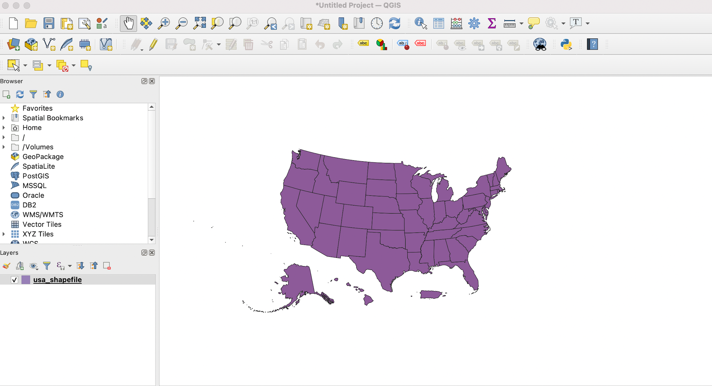
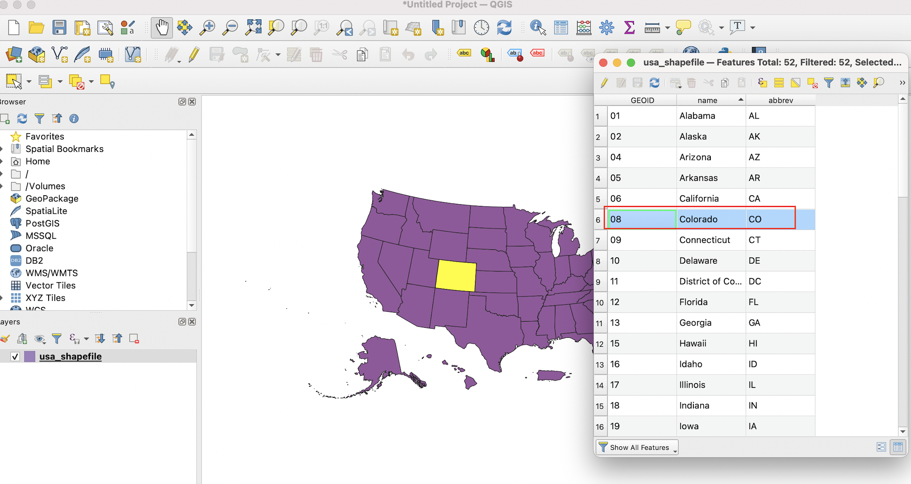
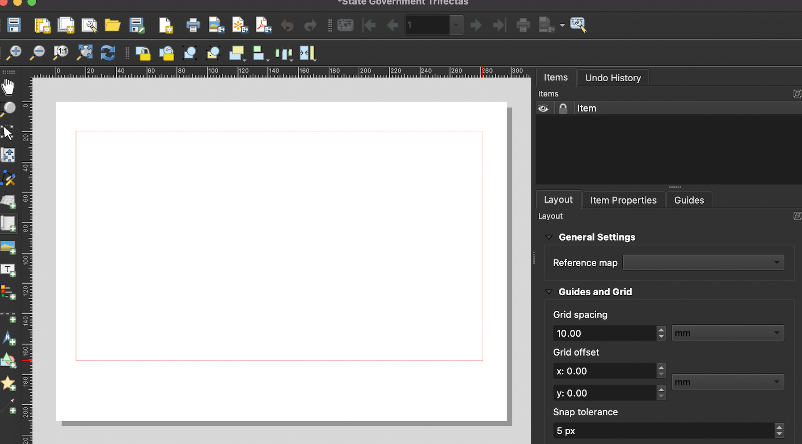
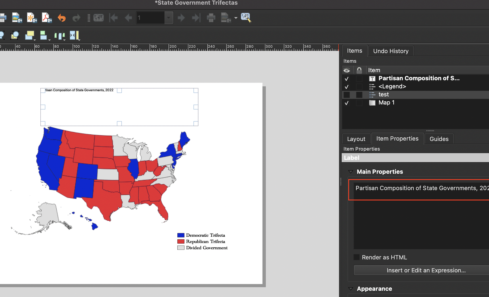

# (PART) Maps in QGIS {-}

# Building Maps in Quantum Geographic Information Systems (QGIS)

When you open up a new QGIS project, the interface will look something like this:

```{r, echo=F, fig.cap="The main QGIS window"}
knitr::include_graphics("screenshots/qgis_window.png")
```

## Adding a spatial dataset to QGIS 

To add a spatial dataset (and in particular, a shapefile) to QGIS, first select ```Layer``` from the top menu, scroll down to ```Add Layer``` and then select ```Add Vector Layer```:

```{r, echo=F, fig.cap="Navigating to the 'Add Vector Layer' Menu"}

```

This will open up the ```Data Source Manager|Vector``` dialog box. Under the ```Source``` tab, click on the ellipsis that is to the right of the box next to the ```Vector Dataset(s)``` label. This ```Browse``` button will open up another dialog box, from which you can navigate to the directory containing your shapefile. 

```{r, echo=F, fig.cap="Click the 'Browse' button to navigate to your shapefile"}
knitr::include_graphics("screenshots/browse.png")
```

Once you are in the directory containing the shapefile you want to import, select the file with the ```.shp``` extension, and click ```Open```.
```{r, echo=F, fig.cap="Select shapefile from directory"}
knitr::include_graphics("screenshots/select_shapefile.png")
```

At this point, you will see the file path to the shapefile under the ```Source``` tab. Once you see this path, go ahead and click the ```Add``` button:

```{r, echo=F, fig.cap="Confirm the shapefile's path and click 'Add'"}
knitr::include_graphics("screenshots/add_shapefile.png")
```


```{r, echo=F, fig.cap="The rendered shapefile/spatial dataset rendered in the QGIS project window" }

```

```{r, echo=F, fig.cap="Open the the shapefile's attribute table" }
knitr::include_graphics("screenshots/open_attribute_table.png")
```

```{r, echo=F, fig.cap="Select a record within the opened attribute table" }

```

```{r, echo=F, fig.cap="Deselect a selected record" }
knitr::include_graphics("screenshots/deselect_layer.png")
```

```{r, echo=F, fig.cap="Navigate to menu that facilitates the importing of tabular data" }

```

```{r, echo=F, fig.cap="Set paremeters before adding the CSV file" }
knitr::include_graphics("screenshots/delimited_text_import.png")
```

```{r, echo=F, fig.cap="Open the CSV file within QGIS" }
knitr::include_graphics("screenshots/open_tabular_data.png")
```

```{r, echo=F, fig.cap="The tabular dataset open within QGIS" }
knitr::include_graphics("screenshots/inspect_table.png")
```

```{r, echo=F, fig.cap="Open the 'properties' dialog box" }
knitr::include_graphics("screenshots/25.png")
```

```{r, echo=F, fig.cap="Initiating a join" }
knitr::include_graphics("screenshots/26.png")
```

```{r, echo=F, fig.cap="The 'Add vector join' dialog box" }

```

```{r, echo=F, fig.cap="Finalize join" }
knitr::include_graphics("screenshots/31.png")
```

```{r, echo=F, fig.cap="Shapefile's attribute table after join" }
knitr::include_graphics("screenshots/35.png")
```


```{r, echo=F, fig.cap="Opening the `Symbology` tab from the `Properties` dialog box" }
knitr::include_graphics("screenshots/symbology1.png")
```

```{r, echo=F, fig.cap="Select classification scheme from menu bar; here, 'Categorized'" }
knitr::include_graphics("screenshots/categorized.png")
```


```{r, echo=F, fig.cap="Select column containing categories to be mapped from the 'value' drop-down menu" }
knitr::include_graphics("screenshots/symbology3.png")
```


```{r, echo=F, fig.cap="Select categories to be displayed" }
knitr::include_graphics("screenshots/selecting_categories.png")
```

```{r, echo=F, fig.cap="Select colors for each category" }
knitr::include_graphics("screenshots/colors.png")
```

```{r, echo=F, fig.cap="Apply color changes" }
knitr::include_graphics("screenshots/colors2.png")
```

```{r, echo=F, fig.cap="Map with changes applied" }
knitr::include_graphics("screenshots/modified_map.png")
```

```{r, echo=F, fig.cap="Open Print Layout" }
knitr::include_graphics("screenshots/printlayout.png")
```

```{r, echo=F, fig.cap="Give Print Layout a title" }
knitr::include_graphics("screenshots/print_layout_title.png")
```


```{r, echo=F, fig.cap="Click 'Add Map' from the 'Add Item' menu bar" }
knitr::include_graphics("screenshots/addmap.png")
```


```{r, echo=F, fig.cap="Click and drag across the map canvas" }

```


```{r, echo=F, fig.cap="Shapefile imported into QGIS print layout as a map" }
knitr::include_graphics("screenshots/map_print_layout.png")
```

```{r, echo=F, fig.cap="Add a legend from the 'Add Item' menu" }
knitr::include_graphics("screenshots/addlegend.png")
```


```{r, echo=F, fig.cap="Legend's initial appearance" }
knitr::include_graphics("screenshots/legendimported.png")
```


```{r, echo=F, fig.cap="Uncheck the auto update button" }
knitr::include_graphics("screenshots/autoupdate.png")
```


```{r, echo=F, fig.cap="Remove superfluous legend category" }
knitr::include_graphics("screenshots/remove_legend_item.png")
```


```{r, echo=F, fig.cap="Remove superfluous legend label" }
knitr::include_graphics("screenshots/delete_legend_items.png")
```


```{r, echo=F, fig.cap="Scroll to legend dialog box's 'Font' section" }
knitr::include_graphics("screenshots/font.png")
```

```{r, echo=F, fig.cap="Click on the 'Font' button under the 'Item Labels' heading" }

```


```{r, echo=F, fig.cap="Set legend font preferences" }
knitr::include_graphics("screenshots/fontdialogbox.png")
```


```{r, echo=F, fig.cap="Click 'Add Label' from the 'Add Item' menu" }
knitr::include_graphics("screenshots/addlabel.png")
```


```{r, echo=F, fig.cap="Print the text for the title in the 'Main Properties' dialog box associated with the label" }

```

```{r, echo=F, fig.cap="Customize the title's font and size" }
knitr::include_graphics("screenshots/titlefontsize.png")
```

```{r, echo=F, fig.cap="Add map credits" }
knitr::include_graphics("screenshots/addcredits.png")
```


```{r, echo=F, fig.cap="Exporting a completed map from QGIS" }
knitr::include_graphics("screenshots/mapexport.png")
```

```{r, echo=F, fig.cap="The map exported from QGIS as a png file" }
knitr::include_graphics("screenshots/trifectas_qgis.png")
```


